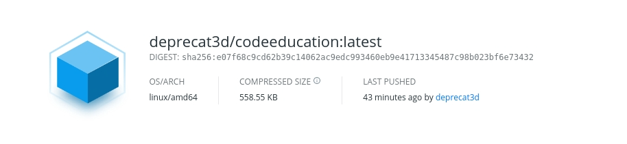
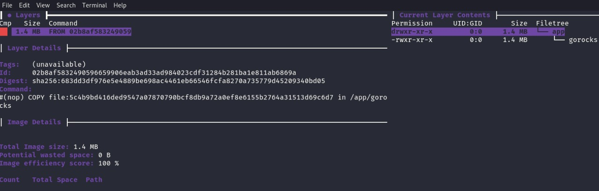

# golang-rocks

## installation guide

##### you can choice between two methods

###### method 1 (git clone)

- clone this repo
- open root of project in your terminal
- run docker build -t deprecat3d/codeeducation
- after create image you can run it with docker run --rm deprecat3d/codeeducation

###### method 2 (dockerhub)

- docker run deprecat3d/codeeducation

## sizes

- in dockerhub
  

- using dive
  
